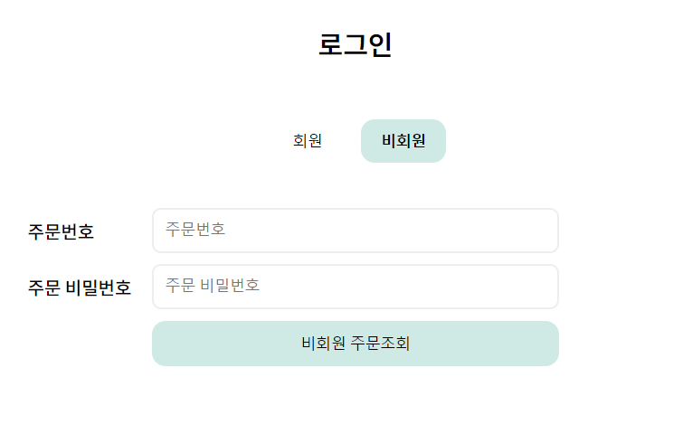

# 쇼핑몰 웹 서비스 프로젝트

## 🎙️ 프로젝트 소개

- 애완 식물을 키우는 사람들과 기념일과 같은 특별한 날에 꽃을 찾는 사람들을 위한 식물 판매 사이트

## 🪄 기술 스택

- FE : ReactJS
- BE : Node.js, Express.js
- DB : MongoDB(NoSQL)
- DevOps : GitLab
- 협업 툴 : Discord

## ⏰ 개발 기간

- 2024. 6. 3. ~ 2024. 6. 21.

### 🧑‍💻 멤버 구성

**[FE]**

- 팀장 : 최지호 - 관리자 카테고리 CRUD 기능, 입력값(로그인/비회원 로그인/회원가입/주문서 작성) 기능, 장바구니(세션 연결) 기능
- 팀원 : 김장현 - 상품 CRUD 기능, 주문 CRUD 기능
- 팀원 : 이도경 - 상품관리자 CRUD, 장바구니 RUD(전체, 부분 삭제, 수정, 조회, 가격 조회), 로그아웃 기능

**[BE]**

- 팀장 : 조수빈 - 회원가입/로그인 기능, 상품 CRUD 기능, 비밀번호 재확인 기능, 코드 통합 및 리팩토링
- 팀원 : 김대중 - 사용자 정보 CRUD 기능, 사용자 주문 CRUD 기능, 비밀번호 재확인 기능
- 팀원 : 장원호 - 대분류 카테고리 CRUD 기능, 소분류 카테고리 CRUD 기능, 관리자 주문 조회/수정 기능

### ✨ 주요 기능

**[로그인 기능]**

- 이메일 & 비밀번호를 DB 데이터와 비교 후 일치할 경우 로그인
- 로그인 시 JWT 토큰 쿠키에 담아 발급
- 탈퇴한 회원의 경우 로그인 불가

**[회원가입 기능]**

- 이름, 이메일, 비밀번호, 전화번호, 주소 필수 입력 & 이용약관 체크한 경우 회원가입
  - 이메일 조건 : @ 포함, .com 또는 .net
  - 비밀번호 조건 : 8자리 이상, 영문자+숫자+특수문자

**[비회원 주문 기능]**

- 비회원 주문 시 이름, 이메일, 전화번호, 주소, 비밀번호 필수 입력
  - 비밀번호 조건 : 4자리 숫자
- 비회원 주문 완료 시 해당 이메일로 주문번호 발송
- 주문번호와 비밀번호(4자리 숫자) 사용하여 주문 내역 확인 가능

**[장바구니 기능]**

- 사용자가 장바구니에 담은 상품들 확인 가능
- +, - 버튼 사용하여 상품 수량 변경 가능
- 체크박스를 사용하여 상품 전체 선택 or 부분 선택 가능

**[관리자 기능]**

- 카테고리 관리: 카테고리 조회/추가/수정/삭제 가능
- 상품관리: 상품 조회/추가/수정/삭제 가능
  - 상품 조회 시 select box 사용하여 필터링 가능
  - 상품 추가 시 상품명, 대분류 카테고리, 소분류 카테고리, 가격, 이미지 필수 입력
- 주문 관리: 주문 조회/수정 가능
  - 완료된 주문 시 주문 취소 및 배송 상태 변경 가능
  - 취소된 주문 or 배송완료 된 주문은 수정 불가

**[마이페이지]**

- 비회원, 회원 모두 주문 조회 가능
- 회원인 경우 비밀번호 재확인 후 회원 정보 조회/수정 및 회원 탈퇴 가능
- 비밀번호 재확인 시 임시 토큰 쿠키에 담아 발급

 

 

[비안타(Pianta)](http://34.64.173.146/)
